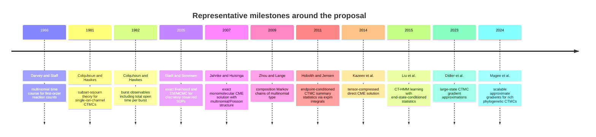

# 2026-05-01 00:00 Literature Review and Novelty Assessment of a Factorized Multinomial-State CTMC Inference Proposal

## Summary judgment

The strongest high-confidence conclusion is that I did **not** find a prior publication that combines all three ingredients you appear to care about into one exact inference framework: an exact **count-space propagator** for many independent identical CTMC particles on a fixed-total multinomial occupancy space, a **bundle of endpoint-conditioned summary statistics** for integrated observables and reward-like functionals, and a **differentiable inference layer** suitable for HMM-style filtering or gradient-based Bayesian estimation on that lumped count space. What I did find is a set of neighboring literatures that each solve an important piece of that puzzle, often very elegantly, but usually in isolation. The nearest mathematical ancestors are the literature on **composition Markov chains** and **monomolecular / first-order reaction networks** for the count-space propagation problem, the **ion-channel / aggregated Markov-process** and broader **endpoint-conditioned CTMC summary-statistics** literature for conditioned moments and sufficient statistics, and the **CT-HMM / phylogenetic CTMC inference** literature for likelihood-based and gradient-based inference using matrix exponentials. Taken together, these sources make the proposal look more like a **new synthesis with a plausible methodological novelty claim** than a rediscovery of a known standard construction. citeturn7view0turn17view0turn34view0turn31view0turn35view1turn11view0

A more fine-grained novelty assessment is this. If the claim is only that “the lumped multinomial occupancy process of many independent identical particles exists and can sometimes be solved exactly,” then that is **not new**: older chemical-kinetics papers, later composition-chain papers, and related spectral work already cover major parts of that territory. If the claim is instead that one can build a **general-purpose, exact, differentiable, endpoint-aware algorithmic layer** for these count processes—especially one organized around recursive composition or binary-doubling ideas and capable of returning not just transition probabilities but also conditioned observable bundles useful for HMM emissions or gradients—then I did **not** locate a direct predecessor, and that is where the contribution seems strongest. citeturn18search2turn17view0turn7view0turn7view1turn34view0turn31view0

## The proposal in literature terms

The easiest way to position the idea is to separate it into three literature-facing claims. First, there is the **state-space claim**: the hidden state is not the full labeled product chain of \(N\) particles, but the **occupancy vector** of how many particles currently lie in each of \(K\) single-particle states, so the latent space is multinomial / composition-valued rather than \(K^N\)-valued. Second, there is the **observable-bundle claim**: one wants exact or cheaply computable endpoint-conditioned expectations, variances, covariances, or Laplace / generating-function objects for additive observables such as integrated occupancies, transition counts, or rewards. Third, there is the **inference claim**: these objects should feed directly into filtering, EM, HMM, variational, or HMC-style inference without reverting to the enormous unlumped product-space matrix exponential. The existing literature contains strong partial matches to each of these three claims, but the matches come from different fields and are not usually unified. citeturn7view0turn34view0turn31view0turn31view2turn35view1

That framing matters because several fields already know one part of the story extremely well. Ion-channel kinetics knows how to condition on observed open/closed aggregates and calculate likelihoods or summary statistics. Chemical kinetics knows how to evolve probability laws on count spaces for unimolecular or more general reaction networks. Composition-chain and multivariate Krawtchouk papers know how to lump independent particles into count processes and transfer spectral structure from the product chain to the count chain. Phylogenetics and continuous-time hidden Markov modeling know how to do exact or approximate likelihood-based inference with \(e^{tQ}\), conditioned sufficient statistics, and expensive matrix-exponential derivatives. The promising gap is that these strands have not, in the sources I reviewed, been assembled into a single method centered on exact, compressed, **occupancy-space differentiable inference**. citeturn22view1turn17view0turn7view0turn34view0turn31view0turn35view1

## The closest prior literatures

The oldest directly relevant count-space work in chemistry is already surprisingly close in spirit. Darvey and Staff showed in 1966 that a general first-order chemical reaction system admits a **multinomial** probability time course for component counts, and Jahnke and Huisinga later gave an exact solution formula for monomolecular reaction systems in which the CME solution is expressed as a convolution of **multinomial and product-Poisson** distributions with time-dependent parameters evolving under classical reaction-rate equations. Those papers establish that exact structured solutions on count spaces are real and not merely asymptotic. More recent work extends this line: Li, Jiang, and Jia derived exact joint distributions for wide classes of first-order stochastic reaction systems in steady state, while Kazeev et al. and Ion et al. pushed tensor and tensor-train methods for solving or inferring CME probability mass functions in high dimensions. The common limitation, relative to your likely target, is that these papers are usually about probability evolution or parameter inference for reaction networks **as such**, not about a reusable endpoint-conditioned observable bundle for a fixed-total multinomial CTMC layer in downstream HMM-style inference. citeturn18search2turn17view0turn26search0turn14view1turn15view0

The mathematically closest “occupation-number” count-process literature is the work on **composition Markov chains of multinomial type**. Zhou and Lange explicitly define a composition chain that records counts \(n_1,\dots,n_d\) when \(n\) particles each evolve among \(d\) states, prove that the lower count chain inherits structure from the upper product chain, show that the equilibrium law is multinomial, and note that much of the theory carries over to continuous time, with Kronecker products and commutativity playing central simplifying roles. Griffiths’ later work on multivariate Krawtchouk polynomials and composition birth-and-death processes similarly studies \(N\) independent and identically distributed birth-death processes whose state is the count vector, and derives spectral expansions in that count representation. This literature is probably the **closest named mathematical home** for the first ingredient of your proposal. But it is not, in the sources I reviewed, an inference literature centered on endpoint-conditioned rewards, gradients, or generic differentiable filtering layers. citeturn7view0turn7view1

The ion-channel and aggregated-Markov-process literature is the closest source for the **second ingredient**, namely endpoint-conditioned or boundary-aware summary statistics. Colquhoun and Hawkes’ 1981 paper established a general method for the distribution of time spent in a specified subset of states in a continuous-time Markov setting for single ion channels, and their 1982 burst paper generalized this to burst observables such as burst length, the number of openings per burst, and **total open time per burst** for arbitrary mechanisms with time-homogeneous transition probabilities. Qin, Auerbach, and Sachs then built maximum-likelihood methods for aggregated Markov processes using forward-backward recursions and derivatives of the likelihood; their later direct-optimization HMM work for single-channel kinetics and Milescu et al.’s macroscopic-current likelihood paper both emphasized **analytical derivatives** for efficient fitting. This is very close to your observable-bundle idea, but the latent process here is usually a **single channel or aggregated state-class process**, not a generic \(N\)-particle multinomial occupancy CTMC with exact count-space factorization. citeturn23search4turn23search6turn22view1turn2search14turn3view2turn3view1

A broader statistical version of that same idea appears in endpoint-conditioned CTMC summary-statistics work. Hobolth and Jensen considered mean time in state, mean transition counts, and more general summary statistics **conditioned on start and end states**, comparing eigenvalue-decomposition, uniformization, and **integrals of matrix exponentials**, and explicitly tying these objects to EM algorithms for discretely observed CTMCs. Their formulas show how conditioned sufficient statistics reduce to matrix-integral objects, and they reference applications spanning DNA evolution, mathematical finance, and ion-channel gating. This paper is one of the closest conceptual bridges from ion-channel theory to general hidden-process inference, and it is probably the single best citation for the “boundary-conditioned moments / integrated rewards” theme. citeturn34view0

On the inference side, Bladt and Sørensen showed that for discretely observed finite-state Markov jump processes, the exact likelihood is naturally written through \(P_t(Q)=\exp(tQ)\), and that EM or MCMC can estimate \(Q\) from those discrete observations. Liu et al. extended this logic into the CT-HMM setting, arguing that efficient learning requires both posterior state probabilities and **end-state-conditioned statistics**, and adapting methods from the CTMC literature to do so at CT-HMM scale. Sherlock and colleagues then argued that direct exact likelihood-based inference via the matrix exponential is practical for many finite MJPs, including filtering and prediction, when one exploits sparsity and computes vector-times-exponential products instead of dense matrix exponentials. These papers are very close to your **inference-layer claim**, but they typically act on the explicit finite generator already given, rather than deriving that generator and its conditioned observable bundle from a many-particle lumped composition principle. citeturn34view2turn31view0turn31view2

Finally, the physics and many-body side supplies the language rather than the full algorithm. Standard second-quantization treatments describe many-body systems in **occupation-number states** and Fock space, and the Doi–Peliti line of work imports creation-annihilation operators and path-integral machinery into classical stochastic processes and CMEs. That makes your “occupation-number propagator” or “bosonic” phrasing completely natural. But these sources mostly provide a representation and calculational formalism, not the exact compressed inference architecture that would make a statistics or machine-learning paper on multinomial-state CTMCs novel. citeturn29view0turn27search5turn27search13turn27search1

| Literature family | What it already gives | What remains missing relative to the proposed contribution | Representative sources |
|---|---|---|---|
| First-order / monomolecular reaction kinetics | Exact structured count-space laws; multinomial and Poisson structure; some exact joint distributions | A generic endpoint-conditioned reward/moment bundle plus HMM-ready differentiable layer | citeturn18search2turn17view0turn26search0 |
| Composition Markov chains | Exact occupancy/count chains for many independent particles; multinomial equilibrium; spectral decomposition; continuous-time carry-over | Statistical inference layer, conditioned observables, gradients, and generic emissions | citeturn7view0turn7view1 |
| Ion-channel aggregated Markov models | Conditioned subset-sojourn times; burst observables; exact missed-event theory; analytical likelihood derivatives | General \(N\)-particle multinomial occupancy formulation and reusable count-space propagator | citeturn22view1turn2search14turn3view2turn3view1 |
| Endpoint-conditioned CTMC summary statistics | Exact conditioned times/jumps; matrix-integral and uniformization machinery; EM relevance | Occupancy-space compression from independent particles and full differentiable count inference | citeturn34view0 |
| CT-HMM / finite MJP inference | Exact likelihoods via \(\exp(tQ)\); filtering, EM, partially observed inference | Compression of \(Q\) via multinomial composition and generalized reward bundles on lumped count spaces | citeturn34view2turn31view0turn31view2 |
| Phylogenetic gradient literature | Strong motivation for differentiable CTMC inference; exact derivative cost is high; approximate gradients used in practice | A count-space factorization that removes or compresses the expensive matrix-exponential derivative burden | citeturn35view1turn11view0turn36search0 |

The development pathway across these fields can be read as a sequence of partial convergences: exact count laws in first-order kinetics, count-space lumping in composition chains, conditioned summary statistics in CTMC and ion-channel work, and differentiable likelihood pressure from modern CT-HMMs and phylogenetics. That is precisely why the synthesis looks plausible and timely. citeturn18search2turn17view0turn7view0turn34view0turn31view0turn35view1

The timeline is important for priority. The count-space and condition-on-endpoints ideas are old; the modern pressure point is **differentiable inference at scale**, where exact matrix-exponential derivatives remain expensive enough that approximation papers are still being published in top venues. In Didier et al., exact matrix-exponential derivatives are explicitly treated as computationally onerous in large-state CTMC inference, and Magee et al. likewise motivate approximate gradients because exact substitution gradients are often computationally prohibitive. That contemporary pressure strengthens the case that an exact-but-compressed multinomial-state layer would be viewed as useful, not merely elegant. citeturn11view0turn35view1turn36search0

## Where the real novelty appears to be

The **weakest** novelty claim would be “I represent \(N\) identical noninteracting CTMC particles by occupancy counts.” Composition-chain work and first-order reaction-network work already make that idea part of the mathematical record. The **strongest** novelty claim would be something closer to: “For a finite single-particle CTMC, I build an exact multinomial occupancy propagator together with exact endpoint-conditioned additive-observable statistics, in a recursive / factorized form that supports stable gradients and scalable HMM or Bayesian inference on the count space.” In the literature I reviewed, that combined statement is not standard. citeturn7view0turn17view0turn34view0turn31view0

The key gap is not simply “count space” versus “product space.” It is the **algorithmic bundle**. Hobolth and Jensen show how times-in-state and transition counts conditioned on endpoints reduce to matrix-integral objects, but they do this for a general finite CTMC and do not exploit the special multinomial occupancy structure of many independent identical particles. Zhou and Lange exploit the occupancy structure, but their emphasis is spectral transfer, reversibility, eigenvectors, and Krawtchouk polynomials, not endpoint-conditioned rewards or differentiable filtering. The chemical-master-equation literature solves or compresses probability evolution on count spaces, but usually does not offer the exact endpoint-aware statistical layer that a modern HMM or HMC user wants. That cross-gap is exactly where a new paper can live. citeturn34view0turn7view0turn14view1turn15view0

There is also a second, more modern novelty angle: the proposal speaks directly to the computational bottleneck that motivates approximation papers in CTMC inference. Large-state phylogenetic CTMC work still wrestles with matrix-exponential derivatives, and even recent authors advocate approximate gradients or mixed analytic/automatic-differentiation strategies because exact derivatives are too slow or too expensive. If your method turns a special but important class of large CTMCs into a **smaller exact inference problem** rather than a generic approximate one, that is more than a formal trick; it is a response to an active computational pain point. citeturn12search1turn9search2turn35view1turn11view0turn36search0

My best overall judgment is therefore this: the idea looks **incremental in representation**, **well grounded in old theory**, but **potentially novel and publishable in algorithmic form** if the paper really delivers all of the following at once: a precise lumping or occupation-number theorem, numerically stable formulas for conditioned observables on the count space, derivative formulas or adjoints that exploit the factorization, and convincing empirical wins over baseline matrix-exponential, uniformization, tensor-train, or particle-based methods. Without those pieces, reviewers could reasonably say the work is “a nice recombination of known ingredients.” With them, the work becomes a method paper rather than a reformulation. citeturn7view0turn34view0turn31view2turn14view1turn15view0turn36search0

## Publication strategy and likely scholarly homes

If the paper is primarily a **probability / stochastic-processes / numerical-methods** contribution, the clearest homes are journals that reward exact finite-state CTMC theory plus computation. On the probability side, **Journal of Applied Probability**, **Advances in Applied Probability**, or **Stochastic Processes and their Applications** would fit if the paper’s main contribution is new theorems about lumping, conditioned observables, or occupation-count processes. On the numerical side, **SIAM Journal on Scientific Computing** or **SIAM Journal on Matrix Analysis and Applications** would fit if the paper’s real advance is an exact matrix-function algorithm, complexity result, or derivative construction for multinomial-state generators. The sources you would be in dialogue with there are Hobolth–Jensen, Bladt–Sørensen, Higham / Al-Mohy–Higham, and the composition-chain papers. citeturn34view0turn34view2turn9search0turn9search5turn7view0

If the paper is primarily a **computational biology / biophysics** method paper, the best fit depends on the showcase application. For ion-channel or receptor-state inference, **Biophysical Journal** is the most natural historical home, because that literature already contains the closest aggregated-Markov and likelihood-derivative precedents. For stochastic reaction networks or general mechanistic biology, **PLOS Computational Biology** or **Journal of Mathematical Biology** would be strong options, especially if the method is presented as a new exact inference engine for a class of chemical master equations or cell-state population models. Those communities already understand the value of exact count-space structure and the curse of dimensionality that your method is trying to evade. citeturn3view1turn3view2turn14view1turn17view0turn15view0

If the paper is framed as a **machine-learning / statistics** contribution—say, a differentiable latent-variable layer for count-space CTMCs with scalable gradients and exact filtering—then **AISTATS**, **JMLR**, or a selective ML conference could work, but only if the paper does more than give elegant formulas. The ML/stat audience will want a clear latent-variable model class, a demonstrable computational bottleneck in existing approaches, an exact or near-exact algorithmic fix, and empirical comparisons against particle methods, generic CT-HMM implementations, and autodiff-heavy baselines. The evidence from CT-HMM learning and phylogenetic gradient papers suggests that this audience would care deeply about the computation story. citeturn31view0turn31view2turn35view1turn36search0

The most defensible **positioning sentence** for the introduction would be something like this, in substance: existing work either studies occupancy-count chains without endpoint-conditioned inference, or studies endpoint-conditioned CTMC statistics without exploiting multinomial occupancy structure, or performs differentiable CTMC inference without an exact compressed count representation. That sentence is well supported by the bodies of literature above and, if made carefully, is likely to survive review. citeturn7view0turn34view0turn31view0turn35view1

## Open questions and limitations

This assessment is strong on the **nearest-neighbor literatures**, but it is not a formal impossibility proof that no precursor exists. Two places where a hidden precursor could still live are older work under names like **occupancy processes**, **lumped independent-particle processes**, **urn models**, or **population-genetics composition chains**, and specialized methodological papers in finance or queueing that compute endpoint-conditioned rewards on structured CTMCs without using the same vocabulary. The fact that Hobolth and Jensen explicitly cite applications in molecular evolution, ion channels, and finance is a reminder that CTMC summary-statistics technology sometimes migrates under very different field labels. citeturn34view0

There is also a substantive limitation in the likely scope. The representation is most naturally exact for **independent identical particles** or unimolecular / first-order network structure. Once interactions, nonlinear propensities, or non-exchangeable particles enter, the clean multinomial occupancy compression partly disappears, and the method’s comparative advantage may soften. That means the paper will need to be very explicit about the class of models for which the exact factorization holds, and equally explicit about what breaks outside that class. The older chemical-kinetics and composition-chain literatures are helpful here because they make the structural assumptions visible rather than implicit. citeturn17view0turn18search2turn7view0

The final limitation is rhetorical rather than technical. Because the prior art is dispersed, reviewers from one field may underestimate the novelty and reviewers from another may miss the older antecedents. The safest strategy is to acknowledge all three parent literatures up front—**composition chains / count-state processes**, **endpoint-conditioned CTMC sufficient statistics**, and **differentiable CTMC inference**—then state sharply that your contribution is the first exact method you are aware of to connect them in one reusable algorithmic layer. That is a claim the literature above can support without overstatement. citeturn7view0turn34view0turn31view0turn35view1